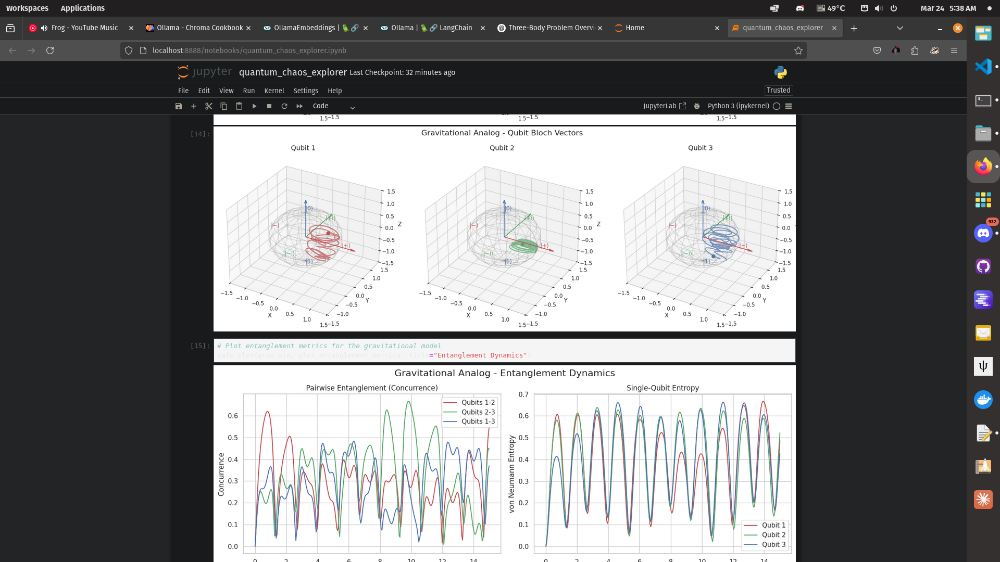
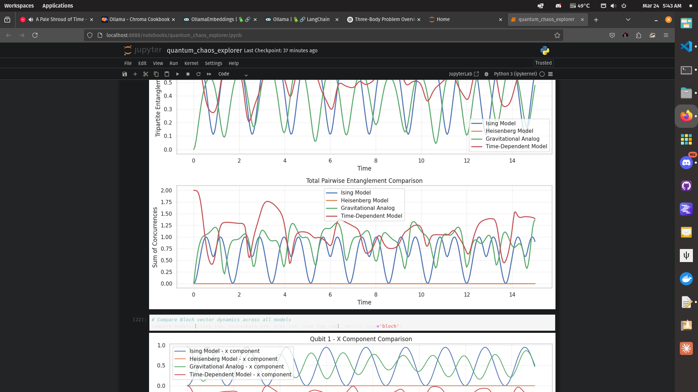

# quantum_three_body
 
# 🌌 Quantum Three-Body Simulation

This project explores the analogy between the classical three-body problem and a system of three entangled qubits. It investigates how quantum entanglement dynamics might mirror or differ from classical chaotic systems, potentially offering insights into quantum-classical correspondence.

A lot isn't working right but maybe someone will have fun with it, I am not a mathematician or coder.




## 🚀 Features

- **Multiple Quantum Models**: 
  - Ising model with transverse field
  - Heisenberg model with anisotropy
  - Gravitational analog model
  - Time-dependent Hamiltonian simulations

- **GPU Acceleration**: 
  - CUDA-powered quantum evolution for faster simulations
  - Parallel computation of quantum chaos metrics
  - Optimized for NVIDIA RTX series GPUs

- **Advanced Analysis**: 
  - Entanglement metrics (concurrence, von Neumann entropy)
  - Quantum chaos indicators (fidelity decay, Lyapunov exponents)
  - Quantum butterfly effect quantification

- **Visualization**: 
  - Interactive Bloch sphere representations
  - 3D phase space visualizations
  - Entanglement dynamics plots
  - Animated quantum state evolution

## 🔬 Scientific Background

The classical three-body problem in physics describes the motion of three objects interacting through gravitational forces. It's famously chaotic and generally lacks analytical solutions. This project explores a quantum analog where three qubits interact through various coupling mechanisms, examining how concepts like chaos, predictability, and information scrambling manifest in quantum systems.

Key research questions include:
- How does quantum entanglement serve as an analog to classical gravitational interaction?
- What quantum signatures correspond to classical chaos?
- How does information spread in coupled qubit systems?
- Where does the quantum-classical correspondence break down?

## 📋 Project Structure

```
quantum_three_body/
├── notebooks/             # Jupyter notebooks for exploration and visualization
│   ├── quantum_simulation.ipynb    # Main simulation notebook
│   └── other exploratory notebooks
├── src/                   # Core simulation code
│   ├── dynamics.py        # Quantum dynamics engine
│   ├── gpu_accelerator.py # GPU acceleration utilities
│   ├── hamiltonian.py     # Quantum Hamiltonian models
│   ├── simulation.py      # High-level simulation presets
│   └── visualization.py   # Visualization tools
├── tests/                 # Unit tests
├── requirements.txt       # Package dependencies
└── README.md              # Project documentation
```

## 🔧 Setup

### Prerequisites

- Python 3.8+
- [QuTiP](https://qutip.org/) for quantum toolbox functions
- NumPy, SciPy, Matplotlib for scientific computing
- [CuPy](https://cupy.dev/) (optional, for GPU acceleration)

### Installation
```bash
# Clone the repository
git clone https://github.com/angrysky56/quantum_three_body.git
cd quantum_three_body

# Create and activate virtual environment
python -m venv venv
source venv/bin/activate  # On Windows: venv\Scripts\activate

# Install dependencies
pip install -r requirements.txt

# For GPU acceleration (CUDA 12.x) Check your cuda version: nvcc --version and alter version below if required

pip install cupy-cuda12x
```

## 💻 Usage

### Quick Start

The easiest way to get started is by running the main simulation notebook:

```bash
# Launch the notebook server
python run_notebook.py
```

Then open `quantum_chaos_explorer.ipynb` in your browser.

### Running Simulations

```python
# Import the simulation module
from src.simulation import SimulationPresets

# Run an Ising model simulation
results = SimulationPresets.run_ising_model(
    J_coupling=1.0,
    h_field=0.5,
    initial_state_type='ghz',
    tmax=10.0,
    nsteps=1000,
    compute_metrics=True
)

# Access the results
dynamics = results['dynamics']
metrics = results['metrics']
```

### Visualization

```python
from src.visualization import plot_three_qubit_bloch_spheres

# Plot Bloch vectors for each qubit
bloch_fig = plot_three_qubit_bloch_spheres(
    results['metrics']['bloch_vectors'],
    title="Ising Model - Qubit Bloch Vectors"
)
```

## 🧪 GPU Acceleration

This project supports GPU acceleration for quantum simulations:

```python
# Forcing CPU mode (if GPU causes issues)
results = SimulationPresets.run_heisenberg_model(
    J_coupling=1.0,
    anisotropy=0.5,
    initial_state_type='ghz',
    force_cpu=True  # Disable GPU acceleration
)
```

For best performance on NVIDIA GPUs:
- CuPy 12.x for CUDA 12.x compatibility
- At least 6GB VRAM for complex simulations
- Reset GPU resources between runs to avoid CUDA memory issues

## 📊 Example Results

The simulations reveal interesting quantum behaviors:

- **Ising Model**: Displays oscillatory entanglement dynamics with partial revivals
- **Heisenberg Model**: Shows complex dynamics due to isotropic interactions
- **Gravitational Analog**: Exhibits chaotic-like behavior similar to classical systems
- **Time-Dependent Models**: Demonstrates resonance effects and complex driving responses

## 📚 Contributing

Contributions are welcome! Please feel free to submit a Pull Request.

## 📄 License

This project is licensed under the MIT License - see the LICENSE file for details.

## 🔗 References

- Nielsen, M. A., & Chuang, I. L. (2010). Quantum Computation and Quantum Information. Cambridge University Press.
- Schlosshauer, M. (2007). Decoherence and the Quantum-to-Classical Transition. Springer.
- QuTiP: Quantum Toolbox in Python, https://qutip.org/

## 👥 Authors

- Claude, GPT4o - Initial work - [angrysky56](https://github.com/angrysky56)